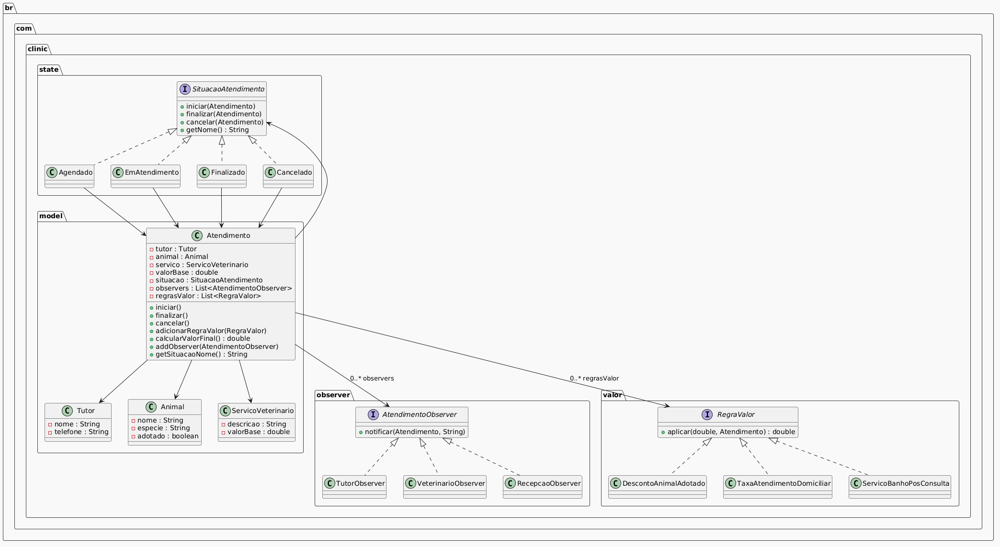

# 🐾 **Vet Clinic – Sistema de Atendimento Veterinário**
### *Projeto acadêmico de Arquitetura de Software com foco em Padrões de Projeto (GoF)*

Este projeto implementa um sistema de atendimento para uma clínica veterinária, desenvolvido como parte da disciplina de **Arquitetura de Software**, com ênfase na aplicação prática dos **padrões de projeto** descritos no livro *Design Patterns: Elements of Reusable Object-Oriented Software* (Gang of Four).

O objetivo é demonstrar como padrões clássicos podem ser aplicados para criar um sistema modular, extensível, de baixo acoplamento e alta coesão.

---

# 📚 **Padrões de Projeto Utilizados**

---

## 🧩 **1. State (Padrão Comportamental)**
Aplicado para controlar o ciclo de vida de um atendimento.

### Situações possíveis:
- **Agendado**
- **EmAtendimento**
- **Finalizado**
- **Cancelado**

Cada estado define:
- Quais transições são permitidas
- Quais ações são proibidas
- Como o atendimento deve reagir

Isso elimina condicionais (`if/else`) e centraliza regras em classes específicas.

---

## 👀 **2. Observer (Padrão Comportamental)**
Usado para notificar automaticamente diferentes partes interessadas quando o atendimento muda de estado.

### Observadores implementados:
- **TutorObserver** → notificado quando o atendimento inicia
- **VeterinarioObserver** → notificado quando o atendimento é cancelado
- **RecepcaoObserver** → notificada quando o atendimento é finalizado

O atendimento mantém uma lista de observers e dispara notificações sem conhecer detalhes de implementação.

---

## ⚙️ **3. Strategy / Chain of Responsibility (Padrões Comportamentais)**
Utilizado para calcular o valor final do atendimento aplicando regras opcionais.

### Regras implementadas:
- **DescontoAnimalAdotado**
- **TaxaAtendimentoDomiciliar**
- **ServicoBanhoPosConsulta**

As regras são independentes e aplicadas em cadeia, permitindo combinações flexíveis.

---

# 🏗️ **Arquitetura do Projeto**

O projeto segue uma estrutura modular organizada por pacotes:

```
src/
 ├── main/java/br/com/clinic/
 │     ├── model/      → Entidades principais (Atendimento, Animal, Tutor...)
 │     ├── state/      → Implementação do padrão State
 │     ├── observer/   → Implementação do padrão Observer
 │     └── valor/      → Estratégias de cálculo de valor
 │
 └── test/java/br/com/clinic/
       ├── state/      → Testes de transição de estados
       ├── observer/   → Testes de notificações
       ├── valor/      → Testes de regras de valor
       └── model/      → Testes de integração do modelo
```

---

# 🖼️ **Diagrama de Classes**

O diagrama completo do sistema está disponível em:

📄 `docs/DiagramaClasseVet.png`

```markdown

```

---

# 🧪 **Testes Automatizados**

O projeto utiliza **JUnit 5 (Jupiter)**:

```xml
<dependency>
    <groupId>org.junit.jupiter</groupId>
    <artifactId>junit-jupiter-engine</artifactId>
    <version>5.5.2</version>
    <scope>test</scope>
</dependency>
```

### Testes implementados:
- ✔ Testes de transição de estados
- ✔ Testes de comportamento inválido
- ✔ Testes de observers
- ✔ Testes de regras de valor
- ✔ Teste de integração do modelo

Para rodar os testes:

```
mvn test
```

---

# ▶️ **Como Executar o Projeto**

1. Certifique-se de ter **Java 17+** instalado
2. Certifique-se de ter **Maven** instalado
3. No diretório do projeto, execute:

```
mvn clean install
```

4. Para rodar a aplicação (se houver um `Main`):

```
mvn exec:java
```

---